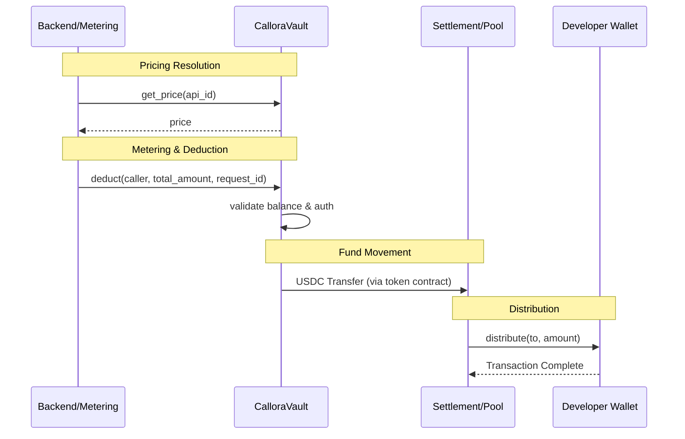

# Callora Contracts

Soroban smart contracts for the Callora API marketplace: prepaid vault (USDC) and balance deduction for pay-per-call settlement.

[](https://github.com/CalloraOrg/Callora-Contracts/actions/workflows/ci.yml)
[](https://github.com/CalloraOrg/Callora-Contracts/actions/workflows/coverage.yml)

## Tech stack

- **Rust** with **Soroban SDK** (Stellar)
- Contract compiles to WebAssembly and deploys to Stellar/Soroban
- Minimal WASM size (~17.5 KB for vault)

## Contract Quickstart

A minimal set of commands to build, test, and produce release WASM for the Soroban contracts in this workspace. Run them from the repository root.

**Prerequisites:** [Rust](https://rustup.rs/) (stable) with the `wasm32-unknown-unknown` target (`rustup target add wasm32-unknown-unknown`).

```bash
# 1. Format & lint (fails on any warning)
cargo fmt --all -- --check
cargo clippy --all-targets --all-features -- -D warnings

# 2. Build and run the full test suite
cargo build
cargo test

# 3. Release WASM for a specific contract
cargo build --target wasm32-unknown-unknown --release -p callora-vault
cargo build --target wasm32-unknown-unknown --release -p callora-revenue-pool
cargo build --target wasm32-unknown-unknown --release -p callora-settlement

# 4. Or build all contracts and verify WASM size limits in one step
./scripts/check-wasm-size.sh

# 5. Line-coverage check (must stay ≥ 95%)
./scripts/coverage.sh
```

Release artifacts land in `target/wasm32-unknown-unknown/release/<crate>.wasm`. The workspace crate names are `callora-vault`, `callora-revenue-pool`, and `callora-settlement` — pass the one you want via `-p`.

## What’s included

### 1. `callora-vault`

The primary storage and metering contract. Holds USDC on behalf of API consumers and deducts balances on every metered call.

- `init(owner, usdc_token, initial_balance, authorized_caller, min_deposit, revenue_pool, max_deduct)` — Initialize with owner and optional configuration. `initial_balance` defaults to `0`; when `> 0` the vault verifies the on-ledger USDC balance covers it. `min_deposit` defaults to `1` and must be `> 0`.
- `deposit(caller, amount)` — Owner or allowed depositor increases ledger balance.
- `deduct(caller, amount, request_id)` — Decrease balance for an API call; routes funds to settlement.
- `batch_deduct(caller, items)` — Atomically process multiple deductions.
- `set_allowed_depositor(caller, depositor)` — Owner-only; delegate deposit rights.
- `set_authorized_caller(caller)` — Owner-only; set the address permitted to trigger deductions.
- `pause(caller)` — Admin/owner-only; activate circuit-breaker to block deposits and deductions.
- `unpause(caller)` — Admin/owner-only; deactivate circuit-breaker to restore operations.
- `is_paused()` — View; returns current pause state.
- `get_meta()` — View; returns `VaultMeta` (owner, balance, authorized_caller, min_deposit). Panics if uninitialized.
- `balance()` — View; returns current USDC balance. Panics if uninitialized.
- `get_admin()` — View; returns current admin address. Panics if uninitialized.
- `get_usdc_token()` — View; returns USDC token contract address. Panics if uninitialized.
- `get_max_deduct()` — View; returns configured max single-deduction (defaults to `i128::MAX`).
- `set_max_deduct(max_deduct)` — Owner-only; updates max single-deduction limit. Requires `max_deduct > 0`.
- `get_settlement()` — View; returns settlement address. Panics if not set.
- `get_revenue_pool()` — View; returns `Option<Address>` revenue pool address.
- `get_contract_addresses()` — View; returns `(usdc_token, settlement, revenue_pool)` in one call.
- `is_authorized_depositor(caller)` — View; returns `bool`. Panics if uninitialized.

## Architecture & Flow

The following diagram illustrates the interaction between the backend, the user's vault, and the settlement contracts during an API call.



## Local setup

1. **Prerequisites:**
   - [Rust](https://rustup.rs/) (stable)
   - [Stellar Soroban CLI](https://developers.stellar.org/docs/smart-contracts/getting-started/setup) (`cargo install soroban-cli`)

2. **Build and test:**

   ```bash
   cargo fmt --all
   cargo clippy --all-targets --all-features -- -D warnings
   cargo build
   cargo test --workspace
   ```

3. **Build WASM:**

   ```bash
   # Build all publishable contract crates and verify their release WASM sizes
   ./scripts/check-wasm-size.sh

   # Or build a specific contract manually
   cargo build --target wasm32-unknown-unknown --release -p callora-vault
   ```

## Development

Use one branch per issue or feature. Run `cargo fmt --all`, `cargo clippy --all-targets --all-features -- -D warnings`, `cargo test --workspace`, and `./scripts/check-wasm-size.sh` before pushing so every publishable contract stays within Soroban's WASM size limit.

### Test coverage

The project enforces a **minimum of 95% line coverage** on every push via GitHub Actions (see [`.github/workflows/coverage.yml`](.github/workflows/coverage.yml)).

```bash
# Run coverage locally
./scripts/coverage.sh
```

## Project layout

```
callora-contracts/
├── .github/workflows/
│   ├── ci.yml              # CI: workspace fmt gate, clippy, test, WASM build
│   └── coverage.yml        # CI: enforces 95% coverage on every push
├── contracts/
│   ├── vault/              # Primary storage and metering
│   ├── revenue_pool/       # Simple revenue distribution
│   └── settlement/         # Advanced balance tracking
├── scripts/
│   ├── coverage.sh         # Local coverage runner
│   └── check-wasm-size.sh  # WASM size verification
├── docs/
│   ├── interfaces/                        # JSON contract interface summaries
│   ├── ACCESS_CONTROL.md                  # Role-based access control overview
│   └── CONTRACT_ADDRESS_CONFIGURATION.md  # Operator guide: configure contract addresses
├── BENCHMARKS.md           # Gas/cost notes
├── EVENT_SCHEMA.md         # Event topics and payloads
├── UPGRADE.md              # Upgrade and migration path
├── SECURITY.md             # Security checklist
└── tarpaulin.toml          # cargo-tarpaulin configuration
```

## Contract interface summaries

Machine-readable JSON summaries of every public function and parameter for each contract are maintained under [`docs/interfaces/`](docs/interfaces/). They serve as the canonical reference for backend integrators using `@stellar/stellar-sdk`.

| File | Contract |
|------|----------|
| [`docs/interfaces/vault.json`](docs/interfaces/vault.json) | `callora-vault` |
| [`docs/interfaces/settlement.json`](docs/interfaces/settlement.json) | `callora-settlement` |
| [`docs/interfaces/revenue_pool.json`](docs/interfaces/revenue_pool.json) | `callora-revenue-pool` |

See [`docs/interfaces/README.md`](docs/interfaces/README.md) for the schema description and regeneration steps.

## Operator Guide

Backend operators setting up a new deployment should follow the step-by-step checklist in
[`docs/CONTRACT_ADDRESS_CONFIGURATION.md`](docs/CONTRACT_ADDRESS_CONFIGURATION.md).
It covers deploying and linking the USDC token, settlement contract, and revenue pool,
plus how to verify all addresses with the `get_contract_addresses()` view function.

## Security Notes

- **Checked arithmetic**: All balance mutations use `checked_add` / `checked_sub` with explicit panics.
- **Input validation**: `amount > 0` enforced on all deposits and deductions.
- **Overflow checks**: Enabled in both dev and release profiles (`Cargo.toml`).
- **Role-Based Access**: Documented in [docs/ACCESS_CONTROL.md](docs/ACCESS_CONTROL.md).
- **Revenue pool admin audit trail**: `callora-revenue-pool::set_admin` now emits `admin_changed` with `(old_admin, new_admin)` before transfer nomination.
- **Dedup hardening**: Duplicate `get_max_deduct` declaration removed in `callora-vault`; allowed depositor duplicate-path test now asserts list cardinality.

See [SECURITY.md](SECURITY.md) for the full Vault Security Checklist and audit recommendations.

---

Part of [Callora](https://github.com/CalloraOrg).

